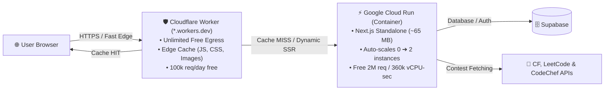

# 🚀 PrepForge OS — Deployment & Architecture Guide

A zero-cost, high-performance deployment architecture utilizing **Google Cloud Run** for serverless container hosting and **Cloudflare Workers** for edge caching and unlimited free egress—requiring **no domain purchase**.

---

## 📐 Architecture Overview



---

## 💰 Free Tier Safety & Cost Guardrails

| Provider & Component | Free Tier Allowance | Our Optimized Usage | Risk of Charges |
| :--- | :--- | :--- | :--- |
| **Cloudflare Bandwidth** | **Unlimited** ($0 egress forever) | All static assets cached at the edge | **0%** (Free forever) |
| **Cloudflare Requests** | **100,000 requests / day** | ~3,000,000 requests / month | **0%** |
| **Cloud Run Egress** | **1 GB / month** | Drops to < 50 MB / month via Cloudflare cache | **0%** |
| **Cloud Run Compute** | **360,000 vCPU-sec / mo** | Scales to 0 when idle (`min-instances: 0`) | **0%** |
| **Cloud Run Memory** | **180,000 GiB-sec / mo** | Capped at `512MiB` container memory | **0%** |
| **Artifact Registry** | **0.5 GB (500 MB) storage** | Standalone Alpine image is **~65 MB** | **0%** (With cleanup policy) |

---

## 🛠️ Step 1: Initial Cloud Run Deployment

### 1. Prerequisites
Ensure you have the Google Cloud CLI installed and authenticated:
```powershell
# Authenticate with Google Cloud
gcloud auth login

# Set your active GCP project ID
gcloud config set project YOUR_PROJECT_ID

# Enable required Google APIs
gcloud services enable run.googleapis.com artifactregistry.googleapis.com cloudbuild.googleapis.com
```

### 2. Deploy Next.js to Cloud Run
Run the deployment command from your project root:
```powershell
gcloud run deploy prepforge-web `
  --source . `
  --region us-central1 `
  --allow-unauthenticated `
  --min-instances 0 `
  --max-instances 2 `
  --memory 512Mi `
  --cpu 1 `
  --timeout 30s
```

> **What this command does:**
> - `--min-instances 0`: Shuts down containers when idle to consume 0 vCPU-seconds.
> - `--source .`: Triggers Cloud Build using our multi-stage [`Dockerfile`](./Dockerfile) generating a tiny **~65 MB** image.
> - `--memory 512Mi`: Keeps memory usage well below free limits while running Next.js smoothly.

Once completed, Google Cloud outputs your live service URL:
```text
https://prepforge-web-xxxxx-uc.a.run.app
```

---

## 🛡️ Step 2: Cloudflare Worker Setup (Edge Proxy & Free Egress)

Because Google owns `run.app`, Cloudflare's standard DNS proxy cannot be attached directly without a custom domain. We solve this using a **Cloudflare Worker** that provides a free `*.workers.dev` domain and edge caching.

### 1. Create a Free Worker
1. Log in to [Cloudflare Dashboard](https://dash.cloudflare.com/).
2. Navigate to **Compute (Workers & Pages)** ➔ **Create Application** ➔ **Create Worker**.
3. Choose **"Start with Hello World"**, name your worker (e.g., `prepforge`), and click **Deploy**.
4. Click **Edit Code**.

### 2. Paste the Reverse Proxy Script
Replace all existing code with the following script:

```javascript
export default {
  async fetch(request, env, ctx) {
    const url = new URL(request.url);

    // 1. REPLACE WITH YOUR EXACT CLOUD RUN URL (no trailing slash)
    const CLOUD_RUN_ORIGIN = "https://prepforge-web-xxxxx-uc.a.run.app";

    const origin = new URL(CLOUD_RUN_ORIGIN);
    url.hostname = origin.hostname;
    url.protocol = origin.protocol;
    url.port = origin.port;

    const cache = caches.default;

    // Identify Next.js static assets that should be cached at Cloudflare edge
    const isStatic =
      url.pathname.startsWith("/_next/static/") ||
      url.pathname.startsWith("/favicon.ico") ||
      url.pathname.endsWith(".png") ||
      url.pathname.endsWith(".svg") ||
      url.pathname.endsWith(".woff2");

    // If it's a static file, check Cloudflare Edge Cache first
    if (isStatic && request.method === "GET") {
      const cachedResponse = await cache.match(request);
      if (cachedResponse) {
        // Returned directly from Cloudflare Edge (0 egress from Cloud Run!)
        return cachedResponse;
      }
    }

    // Forward request to Google Cloud Run
    const newHeaders = new Headers(request.headers);
    newHeaders.set("Host", origin.hostname);
    newHeaders.set("X-Forwarded-Host", url.hostname);

    const originRequest = new Request(url.toString(), {
      method: request.method,
      headers: newHeaders,
      body: request.body,
      redirect: "manual",
    });

    const response = await fetch(originRequest);

    // If it is a static file and successful, save it into Cloudflare Edge Cache
    if (isStatic && response.status === 200) {
      const responseHeaders = new Headers(response.headers);
      responseHeaders.set("Cache-Control", "public, max-age=2592000, immutable");
      responseHeaders.set("x-prepforge-cache", "EDGE-SAVED");

      const responseToCache = new Response(response.body, {
        status: response.status,
        statusText: response.statusText,
        headers: responseHeaders,
      });

      ctx.waitUntil(cache.put(request, responseToCache.clone()));
      return responseToCache;
    }

    return response;
  },
};
```

3. Update line 6 with your actual Cloud Run URL and click **Deploy**.
4. Your site is now live at:
   ```text
   https://prepforge.<your-subdomain>.workers.dev
   ```

---

## 🔄 Step 3: Deploying Future Updates

Whenever you make changes to your code in the future, you **never** need to touch Cloudflare.

### Single-Command Update
From your project directory, run:
```powershell
gcloud run deploy prepforge-web --source . --region us-central1
```

- **Zero Downtime:** Cloud Run starts the new container, performs a health check, and switches traffic seamlessly.
- **Cache Invalidation:** Next.js uses content hashes (e.g. `app-[hash].js`), so Cloudflare automatically pulls and caches new assets immediately.

---

## 🧹 Step 4: Storage Quota Management (Artifact Registry)

Google Cloud Artifact Registry provides **0.5 GB free storage**. Over time, repeated builds push new revisions that could accumulate.

### Configure Automatic Cleanup Policy:
1. In [GCP Console](https://console.cloud.google.com/), go to **Artifact Registry** ➔ **Repositories**.
2. Click on the repository used by Cloud Run (typically `cloud-run-source-deploy`).
3. Click **Edit Repository** ➔ Under **Cleanup policies**, add:
   - **Policy 1:** Keep the **1 most recent version** of each image.
4. Click **Save**.

This permanently caps your container storage usage around **~65 MB**, never exceeding the 500 MB free tier.

---

---

## ⚡ Step 5: Deploying the Lightweight IDE Runner (Python & C++)

The code execution sandbox is located in [`./runner`](./runner). It has been optimized using **Alpine Linux**, dropping the container size from 1.2 GB down to **~100 MB** compressed (installing only Python 3, g++, and Node.js).

### 1. Deploy the Runner to Cloud Run
From your project directory, deploy the runner as a separate microservice:
```powershell
gcloud run deploy prepforge-runner `
  --source ./runner `
  --region us-central1 `
  --allow-unauthenticated `
  --min-instances 0 `
  --max-instances 2 `
  --memory 512Mi `
  --cpu 1 `
  --timeout 15s
```

Note the URL outputted by Cloud Run (e.g. `https://prepforge-runner-xxxxx-uc.a.run.app`).

### 2. Connect `prepforge-web` to `prepforge-runner`
Update your web service with the runner endpoint:
```powershell
gcloud run services update prepforge-web `
  --region us-central1 `
  --set-env-vars PISTON_URL="https://prepforge-runner-xxxxx-uc.a.run.app/api/v2/execute"
```

> **Why this keeps you 100% free:**
> - Both services run in `us-central1`, so traffic between them has **zero network egress charges**.
> - Both images (`prepforge-web` ~65 MB + `prepforge-runner` ~100 MB = **~165 MB total**) comfortably fit well within the **500 MB Artifact Registry free tier**.
> - `--min-instances 0` ensures the sandbox only consumes CPU when code is actively executing.

---

## 🧰 Key Project Configuration Files

- [`Dockerfile`](./Dockerfile) — Multi-stage Alpine build producing Next.js standalone package.
- [`runner/Dockerfile`](./runner/Dockerfile) — Lightweight Alpine container with Python 3 and g++ compilers.
- [`.dockerignore`](./.dockerignore) — Excludes `node_modules`, git, and local assets from uploads.
- [`next.config.ts`](./next.config.ts) — Configured with `output: "standalone"` and `experimental.serverActions.allowedOrigins` for Cloudflare Workers (`*.workers.dev`).
- [`src/utils/supabase/config.ts`](./src/utils/supabase/config.ts) — Centralized Supabase credentials with build and runtime fallbacks.

