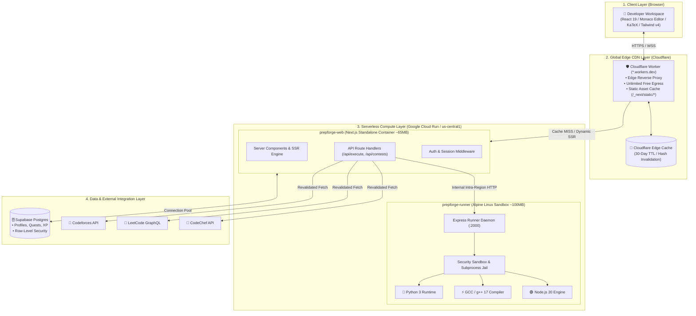
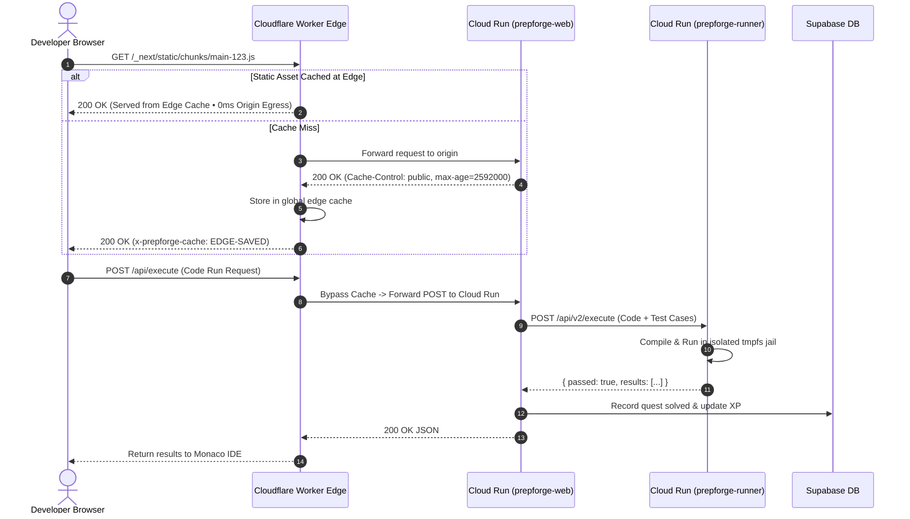
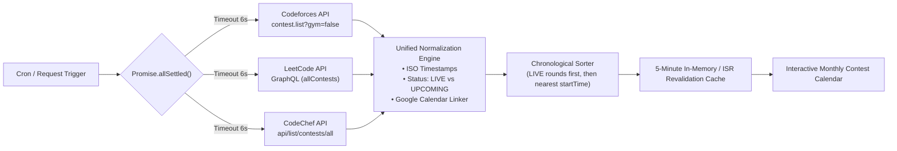
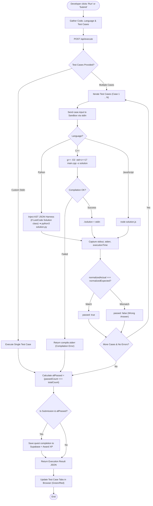
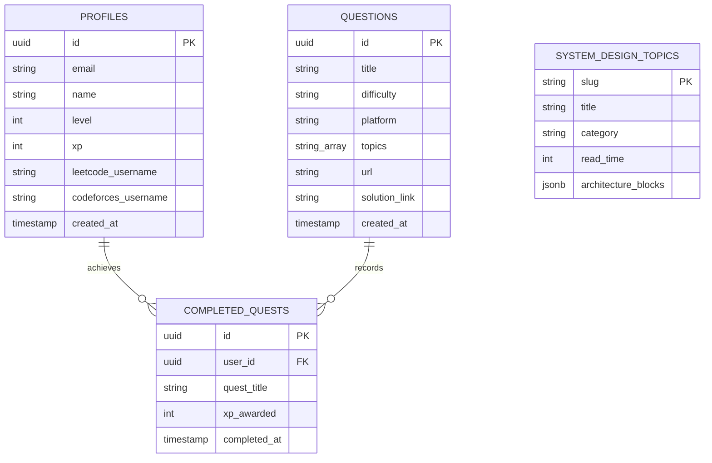
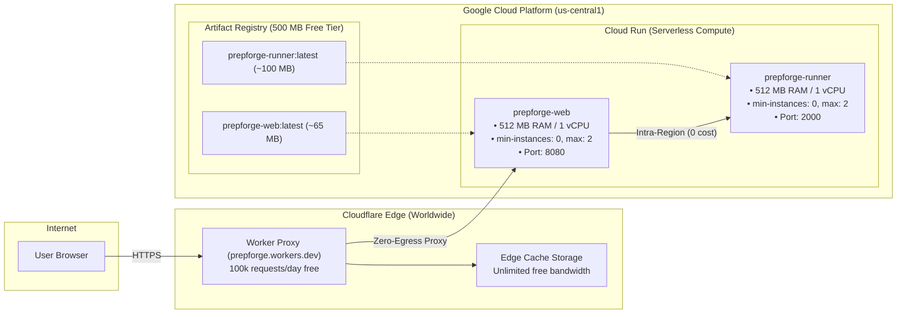

# 🏗️ PrepForge OS — Complete System Design & Architecture Blueprint

An end-to-end technical system design document detailing how **PrepForge OS** operates, executes code, aggregates real-time contest data, synchronizes user developer profiles, and deploys on a serverless zero-cost infrastructure.

---

## 📑 Table of Contents
1. [High-Level Architecture](#1-high-level-architecture)
2. [Network & Edge Topology](#2-network--edge-topology)
3. [Component Deep Dives](#3-component-deep-dives)
   - [A. Next.js 16 Web Core](#a-nextjs-16-web-core)
   - [B. Multi-Platform Contest Aggregator](#b-multi-platform-contest-aggregator)
   - [C. Code Execution Sandbox Engine](#c-code-execution-sandbox-engine)
   - [D. Supabase Auth & Progress Ledger](#d-supabase-auth--progress-ledger)
4. [Request Lifecycle & Execution Flowcharts](#4-request-lifecycle--execution-flowcharts)
5. [Data Models & Schema](#5-data-models--schema)
6. [Deployment Topology & Cloud Infrastructure](#6-deployment-topology--cloud-infrastructure)
7. [Zero-Cost Guardrails & Capacity Planning](#7-zero-cost-guardrails--capacity-planning)

---

## 1. High-Level Architecture

PrepForge OS is designed as a **decoupled, serverless microservice system** optimized for developer experience, sub-second code verification, and zero maintenance overhead.

---

## 2. Network & Edge Topology

The network layer protects origin compute instances from traffic spikes and egress bandwidth exhaustion.

---

## 3. Component Deep Dives

### A. Next.js 16 Web Core (`prepforge-web`)
* **Framework:** Next.js 16.3 (Turbopack, App Router, React 19).
* **Bundle Optimization:** `output: "standalone"` traces file dependencies to generate a headless Node.js server container of only **~65 MB** (dropping over 90% of unused node_modules).
* **CSRF & Proxy Guard:** Configured with `experimental.serverActions.allowedOrigins` to trust requests forwarded through Cloudflare Workers (`*.workers.dev`).

### B. Multi-Platform Contest Aggregator (`/api/contests`)
Aggregates live competitive programming rounds across the top three platforms with parallel fetching, timeout protections, and revalidation caching.

### C. Code Execution Sandbox Engine (`prepforge-runner`)
* **Base OS:** Alpine Linux (eliminates Ubuntu system bloat; compresses down to **~100 MB**).
* **Compilers Included:**
  * `python3`: Native Python 3 runtime with dynamic LeetCode AST harness.
  * `g++`: GNU C++ Compiler supporting `-O2 -std=c++17`.
  * `node`: Built-in Node.js v20 engine.
* **Jail & Isolation:**
  * Executes under an unprivileged user (`sandboxuser:1001`).
  * Isolated temporary directory (`/tmp/interviewos-box-XXXXXX`) created per request and erased immediately in a `finally` block.
  * Strict execution timeouts (4,000 ms runtime limit, 8,000 ms compilation limit) to eliminate infinite loops.
  * Output buffer caps (100 KB stdout limit) to prevent memory-exhaustion attacks (`while True: print(...)`).

---

## 4. Request Lifecycle & Execution Flowcharts

### Problem Workspace Code Execution Flow

---

## 5. Data Models & Schema

---

## 6. Deployment Topology & Cloud Infrastructure

The deployment distributes responsibilities across Cloudflare and Google Cloud Run in the **`us-central1`** region:

---

## 7. Zero-Cost Guardrails & Capacity Planning

| Potential Cost Center | Risk Scenario | Architectural Defense | Resulting Cost |
| :--- | :--- | :--- | :--- |
| **Cloud Run Egress** | Serving 2.9 MB bundles to thousands of users blows past 1 GB/month limit. | **Cloudflare Worker Edge Cache**: Static assets cached for 30 days. Cloud Run only outputs dynamic API responses (<5 KB). | **$0.00 / month** |
| **Cloud Run Compute** | Keeping instances alive 24/7 consumes 2.6M vCPU-seconds (exceeding 360k free limit). | **Scale to Zero (`--min-instances 0`)**: Containers terminate when idle; compute only consumed during active execution. | **$0.00 / month** |
| **Artifact Registry** | Pushing multiple builds builds up 2+ GB of old Docker images. | **Auto-Cleanup Policy**: Retains only the 1 latest version. Total storage capped at ~165 MB (out of 500 MB free quota). | **$0.00 / month** |
| **Infinite Loop Attacks** | Malicious user runs `while True: pass` locking container CPU. | **Subprocess Timeouts**: Runner kills process with `SIGKILL` after 4 seconds and limits stdout to 100 KB. | **$0.00 / month** |
| **Inter-Service Traffic** | Web service sending code to Runner across internet triggers egress. | **Same-Region Routing**: Both services run in `us-central1`; intra-region traffic within GCP is free. | **$0.00 / month** |
